# Ex-04-Multivariate-Analysis

## Aim
To perform Multivariate EDA on the given data set.

##Explanation
Exploratory data analysis is used to understand the messages within a dataset. This technique involves many iterative processes to ensure that the cleaned data is further sorted to better understand the useful meaning.The primary aim with exploratory analysis is to examine the data for distribution, outliers and anomalies to direct specific testing of your hypothesis.

## Algorithm

### Step1
Import the built libraries required to perform EDA and outlier removal.

### Step2
Read the given csv file.

### Step3
Convert the file into a dataframe and get information of the data.

### Step4
Return the objects containing counts of unique values using (value_counts()).

### Step5
Plot the counts in the form of Histogram or Bar Graph.

### Step6
Use seaborn the bar graph comparison of data can be viewed.

### Step7
Find the pairwise correlation of all columns in the dataframe.corr()

### Step8
Save the final data set into the file.

## Code

```
Developed by : M VIGNESH
Registration Number : 212220233002
```

```
import pandas as pd
import numpy as py
import seaborn as sns
import matplotlib.pyplot as plt

df=pd.read_csv('SuperStore.csv')
df
df.head()
df.info()
df.describe()
df.isnull().sum()
df.dtypes

sns.scatterplot(df['Postal Code'],df['Sales'],hue=df['Row ID'])

sns.barplot(x=df['Row ID'],y=df['Sales'],data=df)

states=df.loc[:,["State","Sales"]]
states=states.groupby(by=["State"]).sum().sort_values(by="Sales")
plt.figure(figsize=(17,7))
sns.barplot(x=states.index,y="Sales",data=states)
plt.xticks(rotation = 90)
plt.xlabel=("STATES")
plt.ylabel=("SALES")
plt.show()

sns.barplot(df['Postal Code'],df['Ship Mode'],hue=df['Region'])

df.corr()
sns.heatmap(df.corr(),annot=True)
```

## Output

### Data

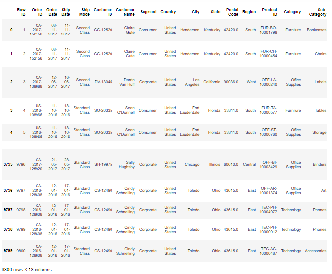

### Data head

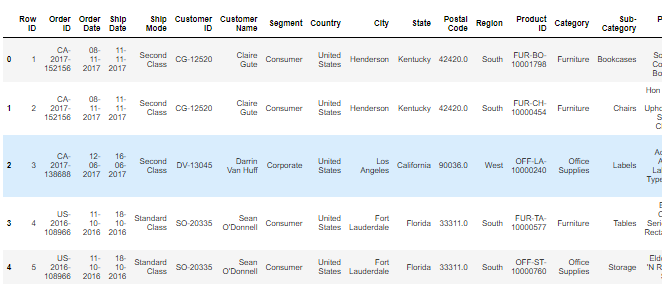

### Data Information

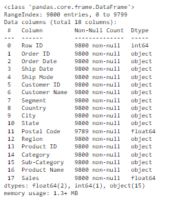

### Data describe

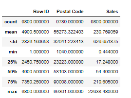

### Data Null Values

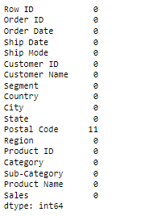

### Data Types

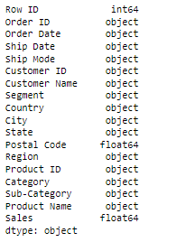

### Scatterplot

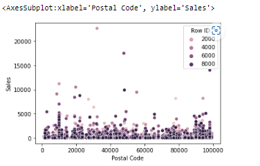

### Barplot

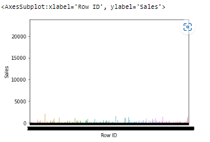

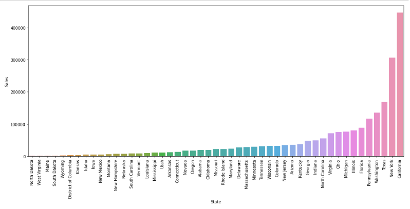

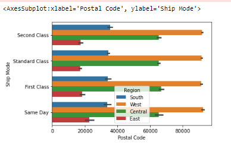

### Correlation and Heatmap
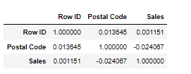

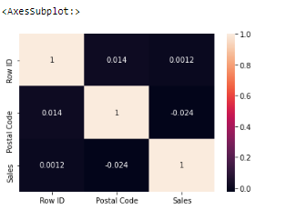

## Result
Thus the program to perform EDA on the given data set is successfully executed.
